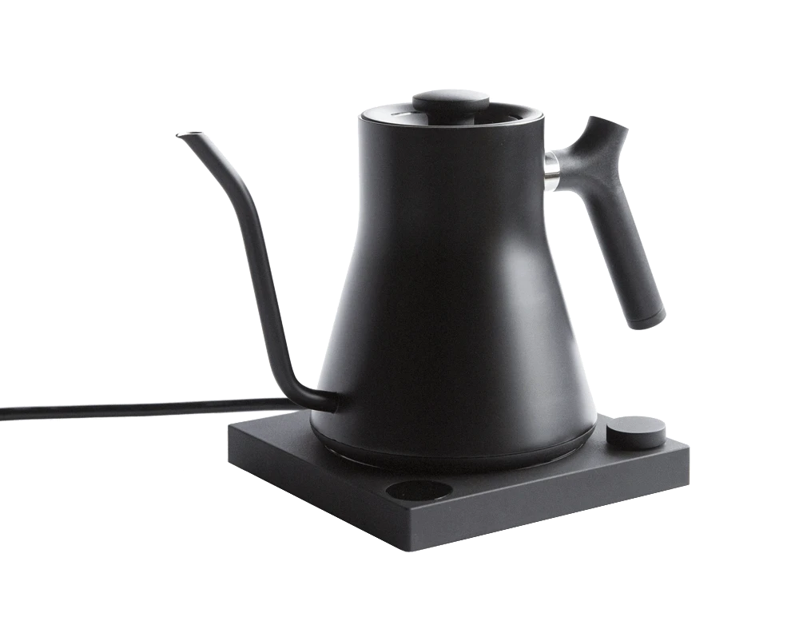
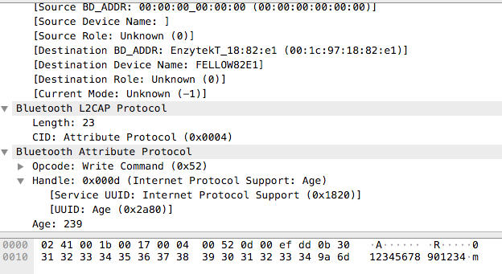

# fellow-stagg-ekg-plus

WiFi & cloud bridge for the [Fellow Stagg EKG+](https://fellowproducts.com/products/stagg-ekg-plus) electric kettle.

## Requirements

Designed to be deployed on an [ESP32-WROVER-B](https://www.espressif.com/en/media_overview/news/new-espressif-module-esp32-wrover-b), though any ESP32-based board will probably work, assuming BLE, WiFi, and pSRAM are available.pSRAM is mandatory because the TLS connection for communicating with Firebase requires a lot (100KB+) of RAM to work.

Other hardware used is an FSR (Force Sensitive Resistor, [Interlink Electronics FSR-402](https://www.interlinkelectronics.com/fsr-402)) to measure fill (e.g.how many oz of water in the kettle), to avoid turning on an empty kettle remotely.

Developed using VSCode & Platform IO.

## Tim's TODOs

- Figure out how to mount the FSR on the kettle in a non-janky way.

## Background

The [Fellow Stagg EKG+](https://fellowproducts.com/products/stagg-ekg-plus) electric kettle is the "smart" version of this line.

It uses the Bluetooth Low Energy protocol through an iOS app to be able to turn the kettle on and off and set its temperature remotely.

While marginally useful as designed, it would be much more convenient to be able to connect a cloud-based assistant service (e.g. Google Assistant, Amazon Alexa) to be able to schedule water boiling and/or trigger it from anywhere. So, my plan was this:

1. Capture iOS app BLE traffic using the [developer profile/sysdiagnose](https://www.bluetooth.com/blog/a-new-way-to-debug-iosbluetooth-applications/) method.
2. Analyze the traffic with [Wireshark](http://wireshark.org).
3. Get a cheap SoC (system-on-a-chip) that supports both BLE and WiFi. I ended up going with the [ESP32-WROVER-B](https://www.espressif.com/en/media_overview/news/new-espressif-module-esp32-wrover-b), specifically [this](https://www.amazon.com/gp/product/B07RW2M8X7/) product.
4. Write ESP32 code to read kettle state and send commands over BLE, reproducing the functionality of the iOS app.
5. Set up a cloud service with an API for clients to be able to read kettle state and send commands. I went with [Google Firebase](https://firebase.google.com), specifically the Realtime Database, because it can potentially integrate directly with Google Assistant, although I didn't go that far.
6. Write ESP32 code to connect to Firebase, pass along kettle state, and poll for commands for the kettle.
7. Set up custom commands for my Google Assistant to send web requests to Firebase to control the kettle.
8. Bonus feature: add some kind of weight sensor to the kettle to measure fill as well as prevent the kettle from being turned on remotely while empty.

## Reverse Engineering

After capturing the BLE traffic, I noticed a few things right away:

1. The manufacturer of the "smart" component was Enzytek - with a Qualcomm SoC, and there were a few references to a "Serial Port Service".
2. All traffic went through a single combination of service/characteristic UUIDs:

  - **Service:** `00001820-0000-1000-8000-00805f9b34fb` (Serial Port Service over BLE)
  - **Characteristic**: `00002A80-0000-1000-8000-00805f9b34fb` (Shows up in Wireshark as "Internet Protocol Support: Age") I kind of assume this is just how Enzytek's firmware implements their simple protocol and not a more broadly accepted standard, which is why Wireshark is a bit confused.

3. About every other packet has the 16-bit value 0xefdd in it (although some packets don't!)

4. The very first packet sent by the app is clearly a magic number:

After that, I wrote some test code to connect to the kettle and just output whatever bytes it sent to the serial console. This made it clear that all communication uses 0xefdd as a frame separator (both rx/tx). I then wrote some code to buffer the state data and output the assembled frames to serial once fully received. Then it was easy to see that the first byte in each frame was a message type, and based on playing around with the kettle itself (turning it off and on, setting different temperatures, turning "hold" on and off, etc... ), it wasn't too hard to get all the various data types, summarized here:

- Each rx frame (state) or tx frame (command) starts with `0xefdd` .
- Magic init sequence to talk to the kettle (hex): `efdd 0b 3031 3233 3435 3637 3839 3031 3233 34 9a 6d` .
- State (rx):

  - `0x00` - Power state (on or off)
  - `0x01` - Hold button state
  - `0x02` - Target temperature & units
  - `0x03` - Actual temperature & units
  - `0x04` - Countdown when kettle is lifted off base
  - `0x05` - Unknown, usually `05ffffff`
  - `0x06` - Whether kettle is in hold mode or not
  - `0x07` - Unknown, usually `070000`
  - `0x08` - Kettle is lifted off base?

- 8 byte commands for power/temp setting, like this:

  - `0xefdd` - Separator
  - `0x0a` - Command, always the same
  - `0x01` - Sequence number, should be incremented every command.
  - `0x00` - Type (power = `0x00` , temp = `0x01` )
  - `0x01` - Value (for power, on = `0x01` off = `0x00` , or temperature value)
  - `0x02` - Checksum (sequence number, byte 3 + previous data, byte 5)
  - `0x00` - Same value as command type (byte 4)
